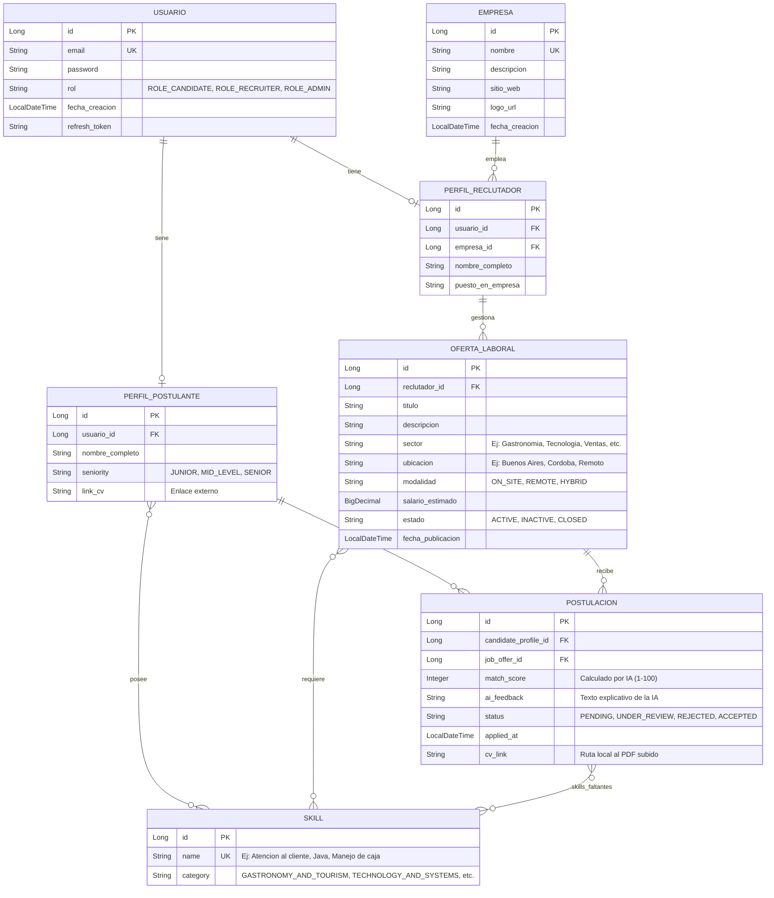

# ATS Smart (AI-Powered) - API RESTful

Bienvenido al repositorio de la API RESTful de **ATS Smart**, un sistema inteligente de análisis de currículums y ofertas laborales desarrollado en **Java 21**, **Spring Boot 4.x**, **Spring Data JPA** y **Spring AI**. El objetivo principal de esta aplicación es automatizar y optimizar el proceso de reclutamiento mediante el uso de inteligencia artificial para evaluar la compatibilidad de los candidatos respecto a los requisitos de las vacantes publicadas, analizando tanto sus habilidades como sus currículums subidos en PDF.

---

## 📊 Diagrama Entidad-Relación (DER)

A continuación se detalla la estructura física y lógica de la base de datos diseñada para soportar el flujo del portal de empleo generalista multi-empresa:



---

## 🛠️ Tecnologías y Dependencias Core

El proyecto cuenta con las siguientes tecnologías clave:
* **Java 21**: La versión LTS más estable y de mayor rendimiento de Java.
* **Spring Boot 4.0.6**: Framework ágil para el desarrollo corporativo en capas.
* **Spring Data JPA**: Abstracción ORM para simplificar el acceso a datos.
* **Spring Security**: Para el control de autenticación y autorización basado en roles.
* **JJWT 0.12.6**: Generación y validación de tokens JWT para autenticación stateless y refresh tokens.
* **Spring AI 2.0.0-RC1**: Integración con modelos de IA (Groq — modelo `llama-3.3-70b-versatile` mediante compatibilidad con API OpenAI) para análisis de compatibilidad.
* **Apache PDFBox 3.0.3**: Extracción de texto de currículums en PDF subidos por los candidatos.
* **Jakarta Validation**: Anotaciones declarativas para validar la entrada de datos.
* **SpringDoc OpenAPI 2.8.5 (Swagger)**: Para la generación y visualización automática de la documentación de los endpoints de la API.
* **PostgreSQL Driver**: Controlador JDBC para la base de datos relacional PostgreSQL (local o en Neon).
* **Lombok**: Automatización de código repetitivo (Getters, Setters, Constructor, Builders).

---

## 📁 Estructura del Proyecto

El backend está diseñado siguiendo un flujo desacoplado en capas independientes:

```
└─ src/main/java/com/atssmart/api
   ├─ config         # Configuraciones globales (Seguridad, Beans de Jackson, etc.)
   ├─ controller     # Controladores REST (HTTP Endpoints)
   ├─ dto            # DTOs (Data Transfer Objects) para encapsular Request y Response
   ├─ enums          # Enums seguros (UserRole, Seniority, JobOfferModality, etc.)
   ├─ exception      # Manejador centralizado de errores (@RestControllerAdvice)
   ├─ mapper         # Convertidores de Entidad a DTO
   ├─ model          # Entidades JPA (Base de Datos)
   ├─ repository     # Interfaces de acceso a base de datos (Spring Data JPA)
   ├─ securityJwt    # Filtros y generadores de Tokens JWT
   ├─ service        # Interfaces e implementación de la lógica de negocio
   └─ util           # Clases útiles (PdfUtils para lectura de PDFs)
```

---

## 🚀 Cómo Iniciar el Proyecto en Desarrollo

Sigue los siguientes pasos para ejecutar y probar la API localmente:

### 1. Requisitos Previos
* **Java 21** instalado en tu sistema.
* **Maven** para la construcción del proyecto.

### 2. Configurar las Variables de Entorno (Local)
Para evitar exponer contraseñas en Git, crea un archivo `src/main/resources/application-local.properties` (que ya está en el `.gitignore`) con las credenciales de tu base de datos PostgreSQL (local o en la nube de Neon) y tu API Key de Groq:

```properties
# Local Database Configuration (PostgreSQL / Neon)
spring.datasource.url=jdbc:postgresql://<TU_HOST_NEON>/neondb?sslmode=require
spring.datasource.username=neondb_owner
spring.datasource.password=TU_CONTRASEÑA

# Groq API Key (Spring AI)
spring.ai.openai.api-key=gsk_TU_API_KEY_DE_GROQ
```

### 3. Ejecutar la Aplicación
Navega a la carpeta raíz del proyecto y ejecuta el siguiente comando en tu consola:
```bash
.\mvnw.cmd spring-boot:run
```
El servidor web se iniciará en el puerto **8080**.

### 4. Documentación interactiva de la API (Swagger UI)
Puedes visualizar los endpoints interactivos ingresando a:
* **Swagger UI**: [http://localhost:8080/swagger-ui/index.html](http://localhost:8080/swagger-ui/index.html)
* **Especificación OpenAPI (JSON)**: [http://localhost:8080/v3/api-docs](http://localhost:8080/v3/api-docs)

---

## 🔑 Endpoints del Sistema

A continuación se detalla la lista completa de endpoints implementados y expuestos en la API:

### 🔐 Autenticación
| Método | Endpoint | Descripción | Acceso |
| :--- | :--- | :--- | :--- |
| `POST` | `/auth/register` | Registrar un nuevo usuario (Candidato/Reclutador) y su perfil base | Público |
| `POST` | `/auth` | Iniciar sesión y obtener accessToken y refreshToken | Público |
| `POST` | `/auth/refresh` | Refrescar un accessToken expirado usando el refreshToken | Público |

### 👤 Perfil del Candidato (`ROLE_CANDIDATE`)
| Método | Endpoint | Descripción | Acceso |
| :--- | :--- | :--- | :--- |
| `GET` | `/api/candidates/me` | Obtener el perfil del candidato autenticado | Candidato |
| `PUT` | `/api/candidates/me` | Actualizar habilidades (`Skills`), seniority y enlace externo de CV | Candidato |

### 🏢 Gestión de Empresas
| Método | Endpoint | Descripción | Acceso |
| :--- | :--- | :--- | :--- |
| `POST` | `/api/companies` | Registrar una nueva empresa en el catálogo | Reclutador / Admin |
| `PUT` | `/api/companies/{id}` | Modificar los datos de una empresa por ID | Reclutador / Admin |
| `GET` | `/api/companies/{id}` | Obtener el detalle de una empresa por ID | Autenticado |
| `GET` | `/api/companies` | Listar todas las empresas registradas | Autenticado |

### 💼 Ofertas Laborales
| Método | Endpoint | Descripción | Acceso |
| :--- | :--- | :--- | :--- |
| `POST` | `/api/job-offers` | Crear una nueva oferta laboral y asociarle habilidades | Reclutador |
| `PUT` | `/api/job-offers/{id}` | Actualizar datos y habilidades de una oferta de empleo | Reclutador |
| `GET` | `/api/job-offers/{id}` | Obtener el detalle de una oferta laboral por ID | Autenticado |
| `DELETE` | `/api/job-offers/{id}` | Eliminar una oferta laboral (solo si es el creador) | Reclutador |
| `GET` | `/api/job-offers/search` | Buscar y filtrar ofertas activas por título, sector, ubicación, modalidad y habilidades | Público |

### 📝 Postulaciones
| Método | Endpoint | Descripción | Acceso |
| :--- | :--- | :--- | :--- |
| `POST` | `/api/job-applications` | Aplicar a una oferta de empleo activa (valida duplicados) | Candidato |
| `PUT` | `/api/job-applications/{id}/status` | Cambiar el estado del proceso (`PENDING`, `UNDER_REVIEW`, `REJECTED`, `ACCEPTED`) | Reclutador |
| `GET` | `/api/job-applications/my-applications` | Obtener el historial de postulaciones del candidato autenticado | Candidato |
| `GET` | `/api/job-applications/by-offer/{offerId}` | Listar todas las postulaciones recibidas en una oferta laboral | Reclutador |
| `POST` | `/api/job-applications/{id}/upload-cv` | Subir archivo PDF de currículum específico para la postulación | Candidato |

### 🤖 Análisis Inteligente e IA
| Método | Endpoint | Descripción | Acceso |
| :--- | :--- | :--- | :--- |
| `PATCH` | `/api/job-applications/{id}/analyze-difference` | Disparar análisis por IA (extrae texto del PDF, evalúa match y detecta brechas de skills) | Reclutador / Candidato |
| `GET` | `/api/job-applications/{jobOfferId}/ranking` | Obtener candidatos ordenados por mayor puntuación (`match_score` desc) | Reclutador |

### 🛠️ Catálogo de Habilidades (Skills)
| Método | Endpoint | Descripción | Acceso |
| :--- | :--- | :--- | :--- |
| `POST` | `/api/skills` | Registrar una nueva habilidad en el catálogo | Admin |
| `PUT` | `/api/skills/{id}` | Modificar una habilidad existente | Admin |
| `GET` | `/api/skills/{id}` | Obtener detalle de una habilidad por ID | Autenticado |
| `GET` | `/api/skills` | Listar todas las habilidades (opcionalmente filtrado por categoría) | Autenticado |
| `DELETE` | `/api/skills/{id}` | Eliminar una habilidad del catálogo | Admin |

### 👤 Perfil del Reclutador
| Método | Endpoint | Descripción | Acceso |
| :--- | :--- | :--- | :--- |
| `POST` | `/api/recruiter-profiles` | Crear perfil de reclutador | Reclutador / Admin |
| `PUT` | `/api/recruiter-profiles/{id}` | Actualizar datos del perfil de reclutador | Reclutador |
| `GET` | `/api/recruiter-profiles/{id}` | Obtener perfil de reclutador por ID | Autenticado |
| `GET` | `/api/recruiter-profiles` | Listar todos los perfiles de reclutadores | Autenticado |
| `DELETE` | `/api/recruiter-profiles/{id}` | Eliminar perfil de reclutador por ID | Admin |

---

## 🛠️ Detalles Adicionales de Implementación

### 📄 Almacenamiento Local de CVs (PDF)
Los currículums asociados a las postulaciones se suben mediante `MultipartFile` y se guardan de forma local en la ruta física del servidor `uploads/cvs/` bajo el nombre estructurado `cv_application_{id}.pdf`. Esta ruta se almacena en el campo `cv_link` de la postulación para su posterior lectura por el motor de extracción de texto.

### 🤖 Verificación de Identidad con IA
Durante el análisis inteligente (`/analyze-difference`), la API extrae el texto del PDF y le solicita al LLM (Groq `llama-3.3-70b-versatile`) que verifique si el nombre encontrado en el currículum coincide con el nombre completo registrado en el perfil del candidato. Si existe una discrepancia evidente (por ejemplo, el CV pertenece a otra persona):
1. Se añade un prefijo `[ALERTA: DISCREPANCIA DE IDENTIDAD]` al inicio del reporte de la IA (`aiFeedback`).
2. Se penaliza drásticamente el puntaje de compatibilidad (`matchScore`) limitándolo a un máximo de **10 puntos**.

